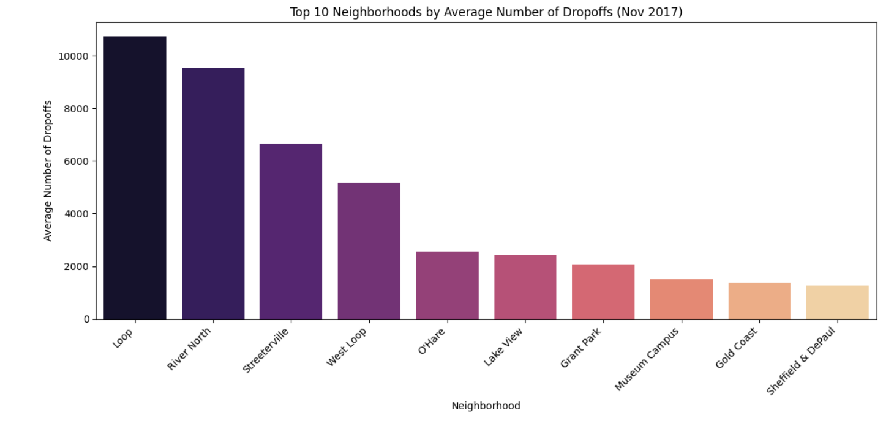
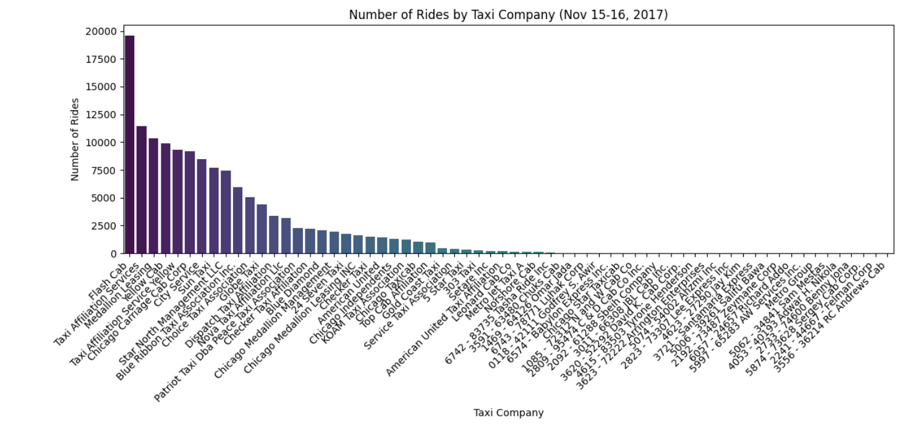
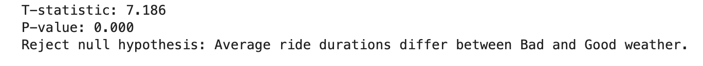

# Ride-Sharing Data Analysis

## Overview
This project analyzes ride-sharing data for Zuber, a new ride-sharing company launching in Chicago.

## Project Visuals

### Top Drop-off Neighborhoods

### Ride Volume by Company

### Hypothesis Testing Result

## Business Problem
The goal was to understand passenger behavior, competitor activity, popular drop-off locations, and how weather affects ride duration.

## What I Did
- Queried ride-sharing data using SQL
- Analyzed taxi company ride volumes
- Identified the top drop-off neighborhoods in Chicago
- Tested whether rainy Saturdays affect ride duration from the Loop to O'Hare Airport
- Visualized key patterns using Python

## Results
- Found that a small number of taxi companies dominate ride volume
- Identified high-demand neighborhoods such as the Loop, River North, and Streeterville
- Found that ride duration differs during bad weather conditions
- Provided insights that could help Zuber improve driver allocation and planning

## Tools Used
- SQL
- Python
- Pandas
- Matplotlib / Seaborn
- Hypothesis Testing

## Business Impact
These insights can help a ride-sharing company better understand demand patterns, improve driver positioning, and plan for weather-related delays.

## Future Improvements
- Incorporate more granular time-based analysis  
- Explore additional external factors affecting demand  
- Build predictive models for ride demand  

## How to Run
1. Clone the repository:
   git clone https://github.com/loran83/ride-sharing-analysis.git

2. Install dependencies:
   pip install pandas matplotlib seaborn

3. Open the notebook:
   ride_sharing_analysis.ipynb
